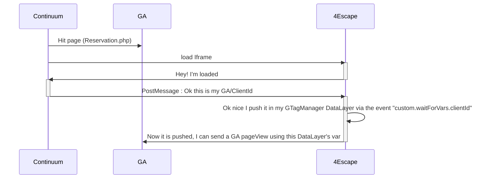

```mermaid
sequenceDiagram
Continuum->>GA: Hit page (Reservation.php)
Continuum->>4Escape: load Iframe
activate 4Escape
4Escape->>Continuum: Hey! I'm loaded
deactivate 4Escape
activate Continuum
Continuum->>4Escape: PostMessage : Ok this is my GA/ClientId
deactivate Continuum
activate 4Escape
4Escape->>4Escape: Ok nice I push it in my GTagManager DataLayer via the event "custom.waitForVars.clientId"
4Escape->>GA: Now it is pushed, I can send a GA pageView using this DataLayer's var
deactivate 4Escape
```

<!--stackedit_data:
eyJoaXN0b3J5IjpbMTE1MDIwMTQxOSwtMjA3MzM2MjM5Nyw0MD
QzNDcxNTZdfQ==
-->