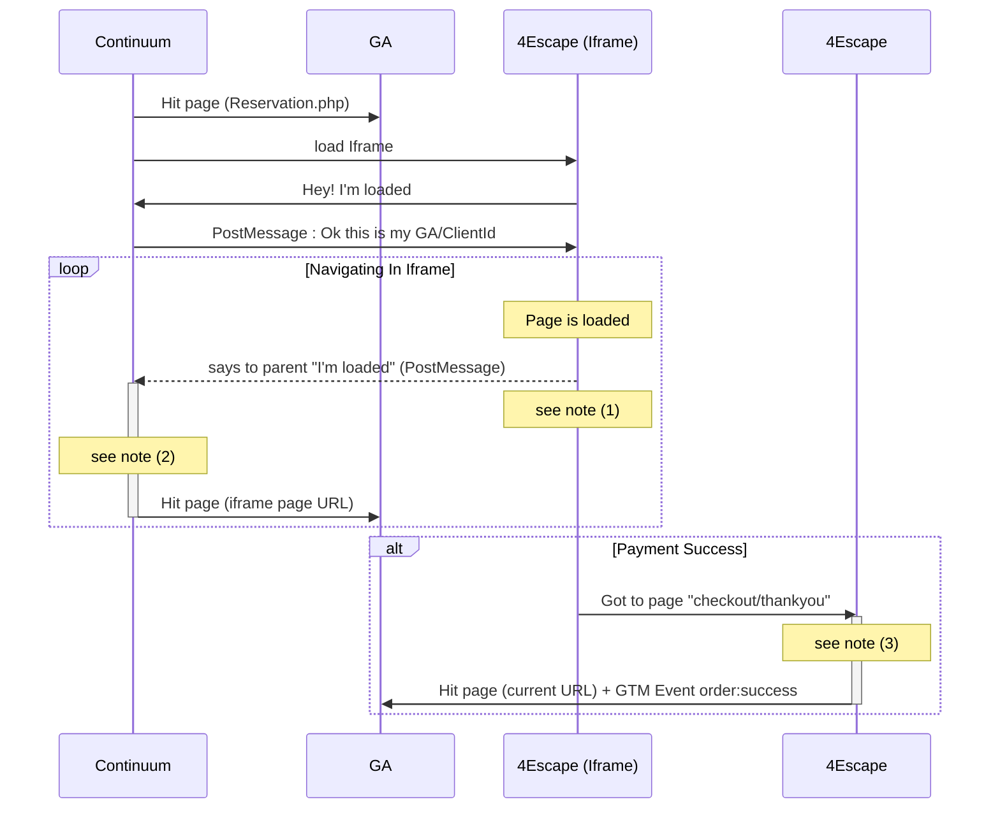

# Continuum - Tag Manager

## Why all of this ?

The goal was to track client navigation and send Google Analytics data through all the order process and until he successfully paid (to track conversion).

'Cause of 4escape iframe's behavior, referrer was lost when user goes through the iframe and if **tag manager** proceeds as expected in the [4escape documentation](https://4escape.groovehq.com/knowledge_base/topics/configurer-google-tag-manager-pour-analytics-adwords-et-facebook-pixel).

So we had to work with [postMessage][1] method to send the GA `clientId`  **from** the iframe **to** the continuum reservation's page. In this way we can't loose referrer.

To make all this stuff working, [this post](https://www.bounteous.com/insights/2015/11/24/tracking-complex-interactions-iframes-embedded-server-side-google-analytics/) inspired me.

## Needed sequences

 

  

Notes:

* (1) send `custom.postMessage.page with` URL data

* (2) wait for `custom.postMessage.page` retrieve data from `dataLayer`

* (3) wait until `window.OrderId` is defined and send `custom.waitForVar.OrderId` event

  

## New triggers

  

Complexity here was to create some **triggers** which divide:

- iframe's URLs from **4escape**

-  **4escape's** URLs not in iframe

-  **Continuum's** URLs.

  

### Why only Iframe's URLs ?

Unfortunatly when the order is successed, 4escape **looses the iframe behavior** and sends the user to a successful page it own... And from here user can navigate on other 4escape's pages...

So we have to tracks, as **Continuum** does, URLs **from 4escapes** which are **not** in Iframe.

What is **not a problem** here: referrer is not lost when user goes in 4escape's successful page.

  
  

### Triggers list

  

#### Triggers depending on user localisation

  

*  **URL Iframe**: checks if `Page URL` contains `iframe=1`

*  **4escape - iframe**: combines **URL Iframe** and checks if `Page Hostname` contains `4escape.io`

*  **4escape - Payment Success Page**: check if `Page Path` contains `checkout/thankyou` AND if the var `4escape - Payment Success` = `1`

*  **Continuum Page Reservation**: check if `Page Path` contains `/reservation.php`

  

#### Triggers depending on custom behaviors

  

*  **Custom - postMessage - Page**: this check if event `custom.postMessage.page` is sent from the `dataLayer` (see below how this event is triggered). It is receiving from **Continuum reservation's page** and notify that data are sent from the iframe

*  **Custom - Wait For Var - OrderId**: this checks if event `custom.waitForVar.OrderId` is sent from the `dataLayer` (see below how this event is triggered). It notifies current page that `window.orderId` is ready to use.

  
  

## New Tags

  

| id | Tags | What's for | Depends On |

| :--:| :--: | - | - |

| **1** | *IFRAME - Html - PostMessage - Send* | Print a JS script which sends the custom event `custom.postMessage.page` to the parent thanks to the **famous**  [postMessage][1] method. |

| **2** | *IFRAME - Html - PostMessage - Receive* | Print a JS script which retrieves the message from the [postMessage][1] method and push data to the `dataLayer`. That's what creates the `custom.postMessage.page` event. | **2** |

| **3** |*GA - Pageview - Virtual - postMessage* | This tag is triggered when the `custom.postMessage.page` event is fired. It retrieves data from `dataLayer` to build **GA PageView hit** with the path of the **Iframe's URL** | **3** |

| **4** | *4escape - Wait for Var - OrderId is set* | Print a JS when `4escape - Payment Succcess Page` is triggered. The script waits until `window.orderId` var is defined and push `custom.waitForVar.OrderId` event to the `dataLayer`. This is a necessary step before sending *GA - Conversion*, *Pixel Facebook - Conversion*, *Adwords - Conversion* and *Google Analytics - Pageview - Not Iframe* |

| **5** | *Google Analytics - Pageview - Not Iframe* | Create a GA PageView hit for all pages (**4escape** and **Continuum** pages included) which are not called in Iframe | **4** |

  

## Improvements

  

Should be great to track every activities on the cart process. Because **4escape** exposes an object in JS with all the checkout data, I create yet a bunch of script to allow it.

Problems is: `orderId` before and after payment is not the same, so we can't rely data on it, it shouldn't be consistent.

Maybe **4escape** can do something for it ?

  

> Written with [StackEdit](https://stackedit.io/).

  

[1]:https://developer.mozilla.org/fr/docs/Web/API/Window/postMessage
<!--stackedit_data:
eyJoaXN0b3J5IjpbODM0NjE0OTkyXX0=
-->