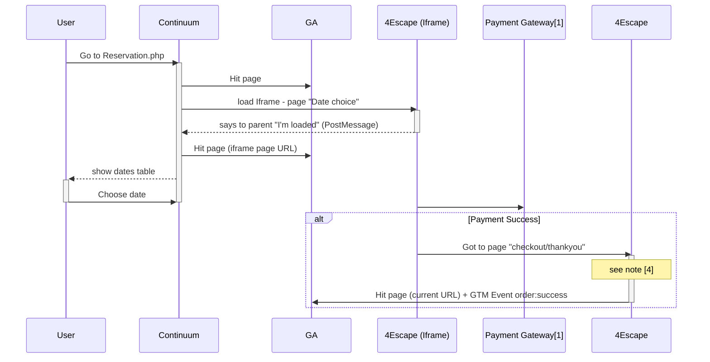

Notes:
* [1] SystemPay via Caisse d'épargne
* [2] send `custom.postMessage.page with` URL data
* [3] wait for `custom.postMessage.page` retrieve data from `dataLayer`
* [4] wait until `window.OrderId` is defined  and send `custom.waitForVar.OrderId` event
<!--stackedit_data:
eyJoaXN0b3J5IjpbMTE0OTk1MTczOSw5NjI5OTkxNTEsLTE5NT
k2MDI4MzJdfQ==
-->