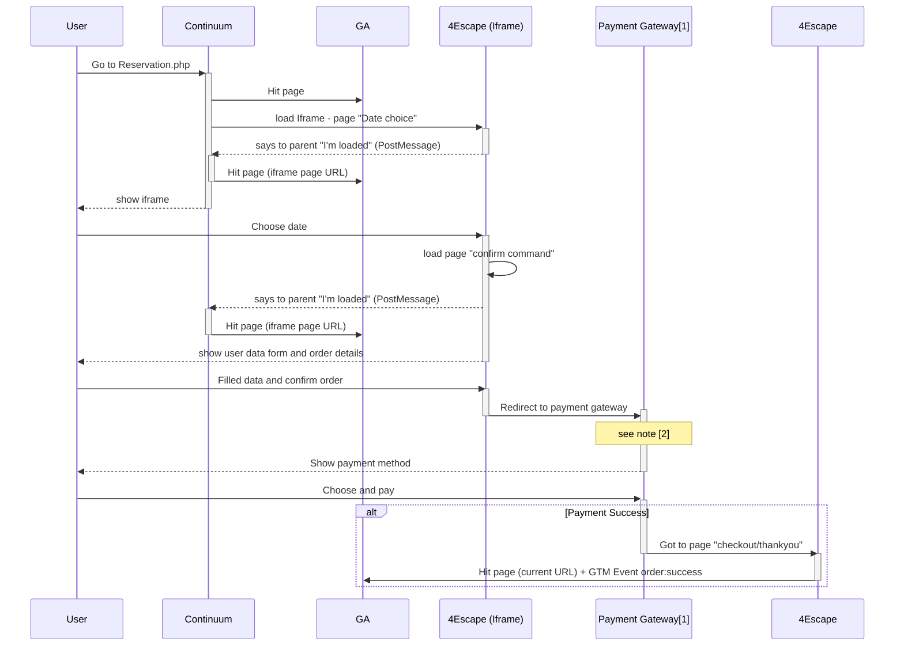

Notes:
* [1] SystemPay via Caisse d'épargne
* [2] This is here we've lost user session for GA and referral ?
<!--stackedit_data:
eyJoaXN0b3J5IjpbLTE2OTM5MjMxNjIsMTkyNTMyNjIzOCw5Nj
I5OTkxNTEsLTE5NTk2MDI4MzJdfQ==
-->