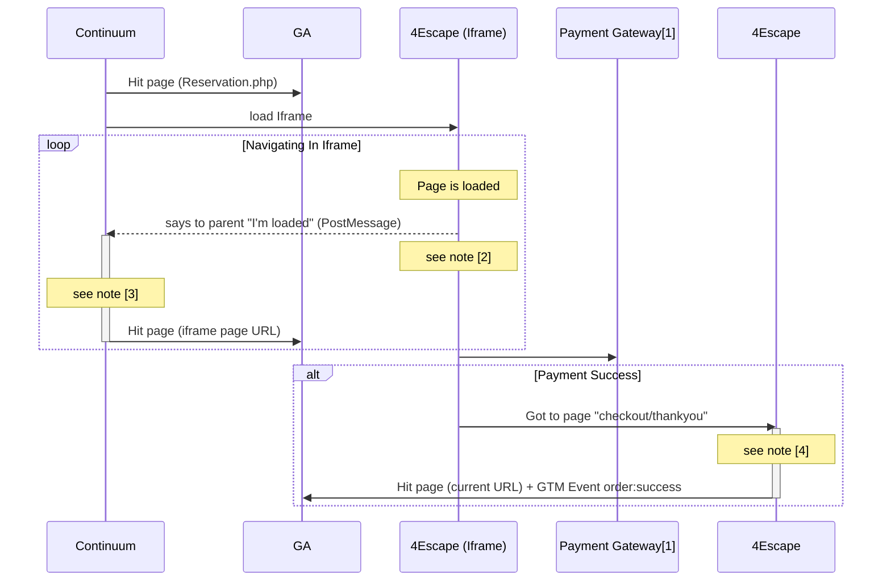

```mermaid
sequenceDiagram
Continuum->>GA: Hit page (Reservation.php) 
Continuum->>4Escape (Iframe): load Iframe 
loop Navigating In Iframe
	Note over 4Escape (Iframe): Page is loaded
	4Escape (Iframe)-->>Continuum: says to parent "I'm loaded" (PostMessage)
	activate Continuum
	Note over 4Escape (Iframe): see note  [2]
	Note over Continuum: see note [3]
	Continuum->>GA: Hit page (iframe page URL)
	deactivate Continuum
end
4Escape (Iframe)->>Payment Gateway[1]: 
alt Payment Success
	4Escape (Iframe)->>4Escape: Got to page "checkout/thankyou"
	activate 4Escape
	Note over 4Escape: see note [4]
	4Escape->>GA: Hit page (current URL) + GTM Event order:success
	deactivate 4Escape
end
```

[1] SystemPay
[2]
[3]
[4]
<!--stackedit_data:
eyJoaXN0b3J5IjpbLTEyMjM1NTc5ODFdfQ==
-->